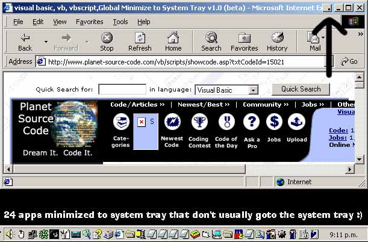



## Global Minimize to Tray v1\.1 beta \*\* UPDATED \*\* \(all code is here\)

### Description

This app creates a new button (top right) for each window. This button if clicked on sends the app and all it's threads to the system tray with the correct icon. If you right click on the button, a list of already minimized apps comes up and you can select one and it will be removed from the tray and back to normal (or you can click on the system tray.. either way). If you use it for a day or so, you won't be able to stop using it. Although it is a bit hard to get used to.

*UPDATES Since 1.0*

----

- Multi-thread Windows now supported (ie VB6)

- Added 'Balloon' Support for Win2000 users

- Added Options Form (not much of an options form though)

- Made much better about form

- Removed many bugs (thanks for bug reports)

- Zip file includes all files (sorry, had files in 2 folders for some reason)

* Please leave comments on bug reports if any as I really want to make this app bug free. *
 
### More Info
 
Creates a '.' button with you 'X', 'Max/Restore', 'minimize' buttons which can send the program to the system tray.

             |
---                |---
**Submitted On**   |2001-02-06 06:45:22
**By**             |[SKoW](https://github.com/Planet-Source-Code/PSCIndex/blob/master/ByAuthor/skow.md)
**Level**          |Advanced
**User Rating**    |4.8 (62 globes from 13 users)
**Compatibility**  |VB 6\.0
**Category**       |[Complete Applications](https://github.com/Planet-Source-Code/PSCIndex/blob/master/ByCategory/complete-applications__1-27.md)
**World**          |[Visual Basic](https://github.com/Planet-Source-Code/PSCIndex/blob/master/ByWorld/visual-basic.md)
**Archive File**   |[CODE\_UPLOAD14552252001\.zip](https://github.com/Planet-Source-Code/skow-global-minimize-to-tray-v1-1-beta-updated-all-code-is-here__1-15030/archive/master.zip)

